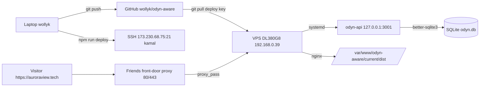

# AuroraView deploy + ops

## Architecture (one paragraph)

Source: `wollyk/odyn-aware`, branch **`deploy/vps-static-and-api`**. The site is a static SPA (Vite + React 19 + TanStack Router CSR + Tailwind 4) built into `dist/`. A tiny Node http API in `server/api.mjs` (better-sqlite3 + Zod, no framework) listens on `127.0.0.1:3001` and persists `/api/early-access` POSTs into SQLite at `/var/www/odyn-aware/data/odyn.db`. On the box, **system nginx** serves the static files and reverse-proxies `/api/*` to the Node service. The Node service is managed by **systemd** unit `odyn-api`. The friend's separate front-door proxy on his LAN owns public 80/443 with the Let's Encrypt cert and forwards traffic for `auroraview.tech` to our box at `192.168.0.39:80` (LAN). DNS: GoDaddy A `@ → 173.230.68.75`, CNAME `www → @`.



## One-command deploy (the answer to "did my change ship?")

From the repo root on the laptop:

```bash
cd C:\Users\wolly\OneDrive\Documents\ODYN_AWARE\odyn-aware-src
npm run deploy                                # commits any pending changes, pushes, pulls+builds+restarts on server, smoke-tests prod
npm run deploy -- "your commit message"       # same with a custom message
```

The script (`scripts/deploy.mjs`) prints six numbered stages and ends with `[deploy] done <url> now serves <commit>`. If a stage fails, fix and re-run.

Each successful deploy appends a JSONL row to `/var/www/odyn-aware/deploy-log.jsonl` on the server with `{ts, action:'deploy', prev, head, msg}`. This is the rollback ledger.

## Rollback

```bash
npm run rollback              # revert to the SHA before the most recent change (deploy or rollback)
npm run rollback -- list      # show last ~15 deploy/rollback events with timestamps
npm run rollback -- <sha>     # revert to a specific commit (any prefix >= 7 chars)
```

`scripts/rollback.mjs`:
1. Looks up the target SHA (from arg, or from the last log entry's `prev`).
2. SSHes to the server, `git fetch --unshallow` (first time) + `git fetch --all`, `git checkout <sha>` into detached HEAD.
3. `npm ci && npm run build`, `systemctl restart odyn-api`, smoke-tests `/` and `/api/health`.
4. Appends `{action:'rollback', prev, head}` to the deploy log.

After a rollback the server is in detached HEAD. The next `npm run deploy` does `git checkout -B <branch> origin/<branch>` which forces it back onto the branch tip — so the cycle is "rollback → fix forward via new commit → deploy". You don't need to manually unstick anything.

**Important caveat** — rollback reverts code only. It does NOT touch the SQLite DB. Schema changes in this repo are additive (`CREATE TABLE IF NOT EXISTS`), so rolling back to a pre-migration commit just leaves the new tables sitting unused. Any future destructive migration (DROP/RENAME COLUMN) needs its own down-migration before rollback is safe past it.

## View early-access submissions

```bash
npm run submissions          # last 50, table view
npm run submissions -- 200   # last 200
npm run submissions -- json  # JSON for piping
```

Or directly from a one-liner without npm:

```powershell
& "C:\Program Files\PuTTY\plink.exe" -ssh -batch -P 21 -pw escevator kamal@173.230.68.75 "echo escevator | sudo -S -p '' sqlite3 -column -header /var/www/odyn-aware/data/odyn.db 'SELECT id, datetime(created_at) AS submitted, name, email, company, environment, ip FROM early_access ORDER BY id DESC LIMIT 50;'"
```

## Server access

- **SSH:** `ssh -p 21 kamal@173.230.68.75` (password auth; server also accepts `~/.ssh/id_ed25519`)
- **Sudo:** kamal has password-required sudo (no NOPASSWD)
- **Hostname:** `DL380G8` (HP DL380 G8). Ubuntu 24.04 LTS, 31 GB RAM, 1.7 TB disk.
- **LAN IP:** `192.168.0.39` (interface `ens3f0`). Public IP `173.230.68.75` is the friend's NAT.
- **Other tenants on the box:** Frigate (NVR) on 8000/8554/8555. Don't disturb. **Never bind to 80, 3000, 8000, 8554, 8555, or 631** — those are taken. Our API uses **3001**.
- **Non-interactive shell from the laptop** (handy for ops):

```powershell
& "C:\Program Files\PuTTY\plink.exe" -ssh -batch -P 21 -pw escevator kamal@173.230.68.75 "<remote bash here>"
```

For commands that need sudo: `echo escevator | sudo -S -p '' <command>`. For multi-line scripts: write a `.sh` locally with LF line endings (the deploy scripts strip `\r\n`) and pipe via `plink ... bash -s`.

Passwords (intentionally documented here so we don't relitigate them):

- SSH password for `kamal`: `escevator` (lowercase)
- Sudo password for `kamal`: same `escevator`

## File and service map on the server

| Path | What |
|---|---|
| `/var/www/odyn-aware/current/` | Checked-out repo (branch `deploy/vps-static-and-api`) |
| `/var/www/odyn-aware/current/dist/` | Built SPA served by nginx |
| `/var/www/odyn-aware/data/odyn.db` | Live SQLite DB. Schema in `server/db.mjs` |
| `/etc/systemd/system/odyn-api.service` | systemd unit running the Node API as `kamal` |
| `/etc/odyn-aware/api.env` | Env file: PORT, HOST, DB_PATH, ALLOWED_ORIGINS, ADMIN_TOKEN, optional SMTP_* |
| `/etc/nginx/sites-available/odyn-aware` | nginx vhost (static + `/api` proxy → 127.0.0.1:3001) |

Common ops commands (all need sudo with the same password):

```bash
sudo systemctl status odyn-api          # API service status
sudo systemctl restart odyn-api         # restart the API
sudo journalctl -u odyn-api -f          # live API logs
sudo nginx -t && sudo systemctl reload nginx
sudo tail -f /var/log/nginx/access.log
```

## Friend's network constraints (do not forget)

- **Ports 80 + 443** on the public IP go through his front-door proxy, not directly to us.
- **Ports 3000–3050** are reserved as available for our box's external exposure if needed.
- Public access flow: `https://auroraview.tech` → friend's proxy (TLS terminates here, Let's Encrypt cert) → `http://192.168.0.39:80` (our nginx) → static OR `/api` → 127.0.0.1:3001 Node.
- Therefore: **don't request our own certbot run on `auroraview.tech` from our box** — TLS is handled by the friend's proxy and a fresh cert request would 1) compete with his cert, 2) need port 80 of the public IP which we don't own.
- **Do not edit the friend's reverse proxy config** without explicit go-ahead. Touching it has been agreed off-limits.

## Iteration workflow (the loop)

```text
1. Edit code in odyn-aware-src/
2. (optional) npm run dev    # local dev at http://localhost:5173
3. npm run deploy            # ~40s, pushes + pulls + builds + restarts + smoke-tests
4. Hard refresh https://auroraview.tech (Ctrl+F5) if browser cached
```

If `npm run deploy` reports HEAD mismatch or the smoke-test fails, SSH in and check `journalctl -u odyn-api -f` and `tail /var/log/nginx/error.log`.

## When to invoke this skill

- "deploy" / "push to prod" / "redeploy"
- "does this change show up on the site"
- "see submissions" / "see leads" / "see signups" / "see the database"
- "ssh into the server" / "log into the server"
- "restart the api" / "logs"
- "auroraview" / "auroraview.tech"
- Anything about the early-access form, SQLite table `early_access`, or systemd unit `odyn-api`
- Questions about the friend's proxy, NAT, port forwards, the DL380G8 box, or 192.168.0.39

When invoked, use the scripts and one-liners above instead of re-deriving them.

## Schema reference (early_access table)

```sql
CREATE TABLE early_access (
  id          INTEGER PRIMARY KEY AUTOINCREMENT,
  created_at  TEXT NOT NULL DEFAULT (strftime('%Y-%m-%dT%H:%M:%fZ','now')),
  name        TEXT NOT NULL,
  email       TEXT NOT NULL,
  company     TEXT NOT NULL,
  environment TEXT NOT NULL,   -- 'hangar' | 'industrial' | 'logistics' | 'other'
  message     TEXT,
  ip          TEXT,
  user_agent  TEXT
);
```

`POST /api/early-access` body shape (Zod-validated): `{ name, email, company, environment, message? }`. Returns `201 {ok:true}` on success, `400 {error:'validation', issues:[...]}` on bad input.

## Git remote / deploy key

The server clones via SSH using a read-only-by-default deploy key on the GitHub repo (configured under Settings → Deploy keys, title contains `DL380G8`). The remote URL on the box uses an SSH config alias: `git@github-odyn:wollyk/odyn-aware.git`.

## Admin login (`/admin`)

The site has a session-cookie-authenticated admin area at `https://auroraview.tech/admin`. Login lives at `/admin/login`. Auth is implemented in `server/auth.mjs` (scrypt password hashing, server-side sessions in SQLite, HttpOnly + Secure + SameSite=Lax cookie named `av_session`, 7-day TTL).

Tables added by `server/db.mjs`:

- `users(id, email UNIQUE, password_hash, role IN ('admin','customer'), created_at, last_login_at)`
- `sessions(id PK, user_id FK, created_at, expires_at, ip, user_agent)`

API endpoints (in `server/api.mjs`):

| Method + path | Auth | What |
|---|---|---|
| `POST /api/auth/login` | none | Body `{email,password}`; on success sets `av_session` cookie and returns `{user:{email,role}}` |
| `POST /api/auth/logout` | session | Clears cookie + deletes session row |
| `GET /api/auth/me` | session | Returns `{user:{email,role}}` or 401 |
| `GET /api/admin/submissions?q=&limit=&offset=&sort=&order=` | admin session | Paginated submissions list with search; sort keys: `id`, `created_at`, `name`, `email`, `company`, `environment` |

### Create or reset the admin user

The first admin (and any password reset) is provisioned with a seed script. There's a local wrapper that SSHes to prod and runs it with sudo:

```bash
cd C:\Users\wolly\OneDrive\Documents\ODYN_AWARE\odyn-aware-src
npm run seed-admin -- you@example.com 'a-strong-password'
```

Same script can run directly on the server if SSH'd in:

```bash
cd /var/www/odyn-aware/current
sudo DB_PATH=/var/www/odyn-aware/data/odyn.db node server/seed-admin.mjs you@example.com 'a-strong-password'
```

Re-running with the same email **resets the password** (upsert by email).

### Local dev

`vite.config.ts` proxies `/api` to `http://127.0.0.1:3001` so the admin pages work in `npm run dev` if `npm run dev:api` is also running. Set `SESSION_SECURE=false` in the API process env when running against http://localhost or the cookie won't be set.

### Env additions for `/etc/odyn-aware/api.env`

- `SESSION_SECURE=true` (default) — set to `false` only for plain-http local dev
- `SESSION_TTL_DAYS=7` (default)

The legacy `GET /api/early-access` with `X-Admin-Token: $ADMIN_TOKEN` is still wired in for backwards-compat with `npm run submissions` tooling, but new tooling should hit `/api/admin/submissions` with a session cookie.
